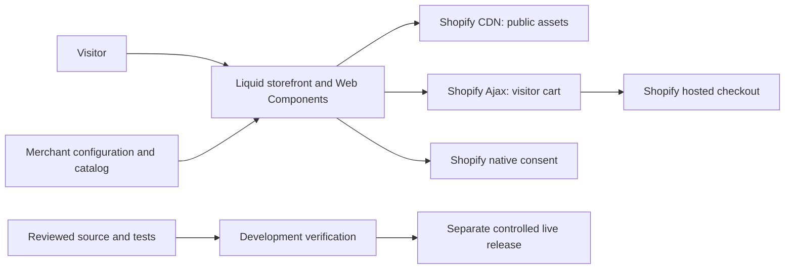

# Kindred Grove

A Shopify pantry storefront with a cinematic, scroll-synchronized homepage, warm cream/terracotta styling, merchant-editable content and a deliberately controlled shopping demo. Built with Liquid, CSS and vanilla JavaScript Web Components; Shopify provides catalog, cart, hosted rendering and checkout services.

**Current delivery:** Phase 2 accepted on the development theme. The redesigned theme is not published live. The connected storefront domain is [kindred-grove.zahidul-islam.com](https://kindred-grove.zahidul-islam.com), which currently serves the existing live theme and may require the development-store password. The GitHub source and the live storefront are separate releases.

## Experience and verified behavior

- Cinematic hero with left-side copy changing with the film's chapters in both scroll directions; pause and reduced-motion behavior.
- Header hides during downward scrolling and returns when scrolling up, focusing navigation, or opening a menu/dialog.
- Product and collection browsing, pantry interactions, quick view and a native Shopify cart drawer with quantity and removal controls.
- Demo notices and sample-price labels; theme checkout and personal-information forms are disabled in demo mode.
- Native consent controls, purpose-gated optional storage and a memory-only pantry quiz. Theme telemetry loaders are removed.
- Responsive layouts, keyboard/focus behavior, mobile navigation without JavaScript and English/Arabic locale source.

Phase 2 evidence: **95/95 security/configuration tests**, **41 browser passes, 0 failures, 5 documented skips**, separate Quiz/Wholesale functional **2/2** and active axe **2/2**, and **150/150 exact local/artifact/development file hashes**. Theme Check reported **0 errors and 2 existing warnings**. See [testing](docs/TESTING.md) for scope, skips and manual checks still needed.

Canonical Quiz/Wholesale pages and a test article are not configured in this store; alternate templates supplied component coverage. Shopify-hosted accounts, checkout and app processing remain platform boundaries. The checkout extension is a [legacy, unsupported scaffold](extensions/checkout-trust-badges/README.md), not a delivered checkout feature.

## Architecture and backend



This repository includes the frontend, Liquid server-rendered templates, test/CI tooling, a projected-capacity model and the retired wholesale Worker source. There is no separate project database or active custom commerce server. The Worker returns HTTP 410 without Admin API side effects; the seed script validates offline example data and rejects remote writes. See [architecture](docs/ARCHITECTURE.md) and [ADR 009](docs/adr/009-retire-wholesale-admin-proxy.md).

## Future scale and reliability

The engineering roadmap targets **10k → 100k → 1M+ simultaneous visitors** and a **99% rolling availability objective**. [Scalability](docs/SCALABILITY.md) gives workload equations, CDN/page/cart/checkout boundaries, bottlenecks, stage gates and conditional backend designs. [Operations](docs/OPERATIONS.md) defines SLIs, error budgets, monitoring, response, recovery and rollback. These documents describe how to qualify each stage, including platform capacity confirmation and representative testing.

The current free/local work introduces no paid service. Future infrastructure and platform entitlements are decisions to price and approve at the relevant stage. A native Shopify architecture is retained until measured requirements justify another service or a headless migration.

## Setup

Use Git and the Node/Shopify CLI/scanner versions maintained in [`scripts/config/toolchain.json`](scripts/config/toolchain.json).

```sh
git clone https://github.com/Zahidulislam2222/kindred-grove.git
cd kindred-grove
npm ci --no-audit --no-fund
npx playwright install chromium
cp .env.example .env
```

Configure the intended store, development theme, browser base/preview URL and optional storefront password in the ignored environment file. See [configuration ownership](docs/CONFIGURATION.md); do not paste credentials into commands or tracked files. The theme renders without npm runtime dependencies; npm installs the test harness.

```sh
# Local source gates; Gitleaks must be available on PATH or GITLEAKS_BIN.
node --test tests/security/*.test.cjs
shopify theme check --fail-level=error

# Actual browser verification on an explicitly configured development target.
node --env-file=.env node_modules/@playwright/test/cli.js test tests/e2e tests/a11y --project=chromium
```

Use `shopify theme dev` only after explicitly configuring the intended store/theme and loading its environment: the watcher uploads edits automatically. For releases, freeze the reviewed artifact, compare remote state before writing, then pull and compare hashes. [Release guide](docs/RELEASE.md).

## Documentation

| Need | Start here |
|---|---|
| Complete public documentation navigation | [Documentation index](docs/README.md) |
| Source structure, service ownership and decisions | [Architecture](docs/ARCHITECTURE.md), [ADRs](docs/adr/001-theme-blocks-over-legacy-sections.md) |
| Developer onboarding and configuration | [Contributing](CONTRIBUTING.md), [Configuration](docs/CONFIGURATION.md) |
| Security, data and demo controls | [Security](docs/SECURITY.md), [Privacy](docs/PRIVACY.md), [Demo safety](docs/DEMO-SAFETY.md) |
| US/EU requirements and commercial launch prerequisites | [Compliance research](docs/COMPLIANCE-RESEARCH.md) |
| Future 1M+ visitor architecture and 99% availability | [Scalability](docs/SCALABILITY.md), [Operations](docs/OPERATIONS.md) |
| Performance and accessible interactions | [Performance](docs/PERFORMANCE.md), [Accessibility](docs/ACCESSIBILITY.md) |
| Actual checks, known defects and publication | [Testing](docs/TESTING.md), [Defect log](DEFECT-LOG.md), [Release](docs/RELEASE.md) |
| Merchant editing and truthful product content | [Merchant guide](docs/MERCHANT-GUIDE.md), [Media provenance](docs/MEDIA-PROVENANCE.md), [Metaobjects](docs/metaobjects/SCHEMAS.md) |
| Milestones and maintenance | [Build plan](BUILD-PLAN.md), [Roadmap](docs/ROADMAP.md), [Changelog](docs/CHANGELOG.md) |
| Responsible assisted development | [AI workflow](docs/AI-WORKFLOW.md), [Governance](docs/AI_GOVERNANCE.md) |

## Repository layout

`layout`, `templates`, `sections`, `blocks` and `snippets` contain Liquid composition. `assets` contains styles, components and demo media. `config` and `locales` own merchant settings and translated copy. `scripts` contains configuration, CI, offline catalog and capacity tools. `tests` contains committed automated regressions. `.github` contains workflow definitions. `extensions` contains the isolated legacy checkout example.

Private recovery records, credentials, local research, browser artifacts and client document exports are excluded from the public repository. Public documentation is written for developers, merchants and clients, without access details or customer information.

## License and content rights

Code is provided under [MIT](LICENSE), except where a component explicitly states otherwise. The extension scaffold declares its own license status. Product facts, brand identity and third-party media are separate from the code license. Consult [media provenance](docs/MEDIA-PROVENANCE.md) before reuse; current imagery/video rights are not established by the presence of files in Git.
