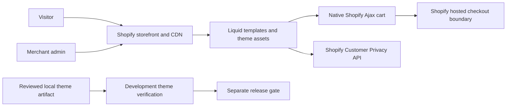

# Storefront architecture

Updated 2026-09-24. Kindred Grove is an unbundled Shopify Liquid theme with vanilla JavaScript enhancements. It is a demonstration storefront, not a custom commerce backend. Phase 2 is accepted on the development theme; [BUILD-PLAN.md](../BUILD-PLAN.md) owns phase status.

## System boundaries

Shopify owns hosted rendering, catalog, inventory, cart and checkout services. Theme code controls presentation and browser enhancements, not Shopify's infrastructure capacity, payment authorization, order durability or service SLA. No custom Admin API is used for each visitor. The former wholesale draft-order Worker is retired locally and returns 410 without side effects; no remote undeployment is claimed. [ADR-009](adr/009-retire-wholesale-admin-proxy.md).

## Source organization

| Location | Responsibility |
|---|---|
| `layout/` | Document structure, native Shopify injected content, theme configuration delivery and deferred assets |
| `templates/` | Native Shopify route/template composition |
| `sections/`, `blocks/` | Merchant-editable presentation and product/cart/form components |
| `snippets/` | Reused markup, configuration transport, product cards and structured data |
| `assets/` | Unbundled styles, Web Components and static demo media |
| `config/`, `locales/` | Shopify settings and maintained translated interface content |
| `scripts/config/` | Validated local/CI tool configuration and version manifest |
| `scripts/ci/` | CI prerequisites, preview validation and release blocking helpers |
| `scripts/capacity/` | Projected workload model and loopback-only mock harness |
| `tests/` | Committed automated security, browser, accessibility and optional visual tests |
| `docs/` | Public engineering evidence and decisions |

Private credentials, remote snapshots, investigation notes and recovery records are ignored and must not enter the theme upload or public repository. Personal diagnostic scripts remain in the private project recovery area; they are separate from the committed CI suite.

## Rendering and interaction

Liquid renders real catalog data and native navigation. JavaScript enhances the page through custom elements: Grove header/journey/pantry interactions, product variants and gallery, cart drawer, search, quick view, recommendations, quiz and recently viewed history. Native links and suitable forms remain the fallback where JavaScript is unavailable; demo mode deliberately disables real personal-data submissions and theme checkout controls under the accepted Phase 2 controls.

The cinematic hero maps scroll position to film time and updates its left-side copy by actual chapters. Header scroll direction uses hysteresis, shows navigation when focused/open and reserves layout height. Visible header height separately positions the sticky hero. Reduced-motion mode retains a static poster. Actual pause/seek and chapter regressions passed on development; media-byte performance measurement remains a future milestone. See [PERFORMANCE.md](PERFORMANCE.md).

The theme should use Shopify's locale-aware routes and native country selection; changing client text or a test label does not change actual market availability. Native admin currently has United States and Canada active. EU selling configuration requires merchant product, tax, shipping and legal facts.

## Configuration and trust

- Merchant choices and content belong in native theme/section/block settings, locales and product/metafield data.
- Node test targets, passwords and runner defaults pass through `scripts/config/test-config.cjs`; the toolchain is pinned in `scripts/config/toolchain.json`.
- CI preview output must match the independently configured Shopify store and theme ID. Password entry additionally checks the actual navigation and form target origins. Explicit local custom-domain configuration is a trusted input; CLI output is not allowed to create that trust by itself.
- Merchant JSON definitions use escaped template attributes rather than executable script text. Hostile-input regressions cover this transport; future components must use the same boundary.
- Browser API requests require same-origin route validation, bounded cancellation and safe rendering. The reviewed runtime and cart hardening passed the Phase 2 source and browser gates. HTML escaping alone does not make an arbitrary URL safe.
- A timeout after a cart write is an unknown outcome; do not automatically retry and create duplicate additions.

[CONFIGURATION.md](CONFIGURATION.md) records implemented owners and remaining migration work. It does not claim all historical literals have already been removed.

## Privacy and personal data

The local consent adapter denies optional purposes until both explicit native visitor consent and the matching Shopify processing permission allow them. GPC/DNT deny theme analytics/marketing/data-sharing purposes. Feature assignments use analytics consent; recently viewed storage uses preferences consent; quiz answers stay in page memory. The native banner is configured worldwide, and actual native accept/partial/withdrawal/reload tests passed.

Optional custom Sentry/Web Vitals loaders are removed locally. Theme telemetry callbacks have been removed; Shopify/app collection is outside the adapter's authority. Shopify Network Intelligence remains enabled. Do not claim the whole platform has no tracking. [PRIVACY.md](PRIVACY.md) and [COMPLIANCE-RESEARCH.md](COMPLIANCE-RESEARCH.md) own detailed controls and applicability.

## Security and delivery

CSP is currently a theme meta policy; it has platform constraints and is not evidence of a strict server-header policy. Contextual escaping, URL validation, native form handling, private secret storage and explicit authorization remain necessary. Client honeypots and cooldowns are UX/abuse friction, not server authorization.

Local source and history scans, meaningful regression tests, Theme Check, actual browser flows and independent review are distinct gates. No scanner establishes complete security. Current workflow definitions pin external actions and separate offline checks from manual credentialed previews. Release workflows fail closed until drift/parity automation is integrated. The native GitHub settings and hosted successful checks are not inferred from local YAML. See [SECURITY.md](SECURITY.md) and [TESTING.md](TESTING.md).

Deployment order: inspect native theme role → retain remote snapshot → reconcile drift locally → validate/review exact artifact → upload only reviewed files to development → pull/hash parity → exercise real flows. Live publication is a distinct release decision. Checkpoints before and after mutations make interrupted work recoverable without blindly replaying requests.

## Capacity and availability

[SCALABILITY.md](SCALABILITY.md) models 10k/100k/1M visitor scenarios separately from request rates, cache misses, cart writes and checkout starts. The harness creates only a local synthetic server and cannot establish Shopify capacity. A migration to a custom headless stack is not required merely to make the architecture look scalable; it adds services and obligations that need their own evidence.

[OPERATIONS.md](OPERATIONS.md) defines the proposed 99% rolling availability objective, separate browsing/cart/checkout indicators, missing-observation coverage, incident response and recovery rehearsal. No continuous observed uptime or million-user capacity is claimed.
