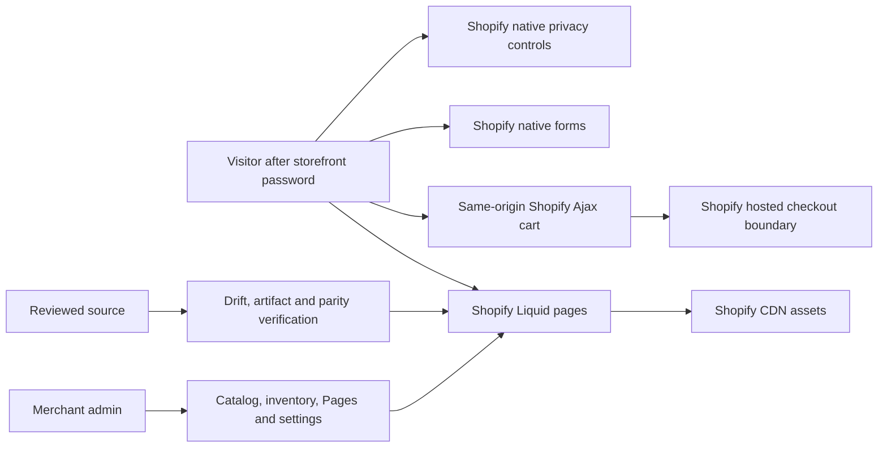

# Backend ownership and service contracts

Reviewed: 2026-10-08. Kindred Grove uses Shopify's managed backend with Liquid server rendering. This repository ships the frontend, server-rendered theme definitions, maintained content and supporting engineering tools. It does not operate a separate commerce database or an active custom commerce API.

## Request and data ownership

| Capability | Active owner / contract | Project responsibility | Current evidence or next gate |
|---|---|---|---|
| Page rendering | Shopify Liquid, native routes and Shopify Pages | Accessible markup, contextual escaping, maintained content and correct template composition | Seven canonical content pages and native product/collection/search routes exercised |
| Catalog and inventory | Shopify product/variant/catalog records | Render platform values; prevent misleading price, availability or provenance claims | Browsing verified; supplier/label/stock accuracy needs merchant approval |
| Cart reads | Locale-aware same-origin Shopify Ajax route | Bound reads, validate responses, present actual line state | Actual add/change/remove and reconciliation exercised |
| Cart mutations | Shopify session-specific cart | Serialize intent; never blindly retry an uncertain side effect; reconcile from platform state | Browser cart count 0→1→2→0 verified; no payment/order placed |
| Contact, wholesale, newsletter | Shopify-native form processing | Clear labels/errors, consent notices and honest success handling | Controls inspected; actual inbox delivery and subscription operations remain unverified |
| Customer accounts | Shopify account surfaces and any classic theme templates | Treat account identifiers and rendering as private; preserve platform authentication | Hosted-account authorization requires separate real-flow verification |
| Checkout and payments | Shopify plus merchant-selected providers | Navigate through native controls, avoid card-data collection in theme code | Current dev store cannot process real transactions; commercial setup is a future gate |
| Privacy preferences | Native Shopify Customer Privacy API/banner | Deny optional theme purposes until explicit consent and platform permission; cleanup owned state | Accept/partial/withdraw/reload and GPC/DNT behavior tested |
| Content maintenance | Native settings/locales, Pages, product/metafield data | Maintain product data outside control-flow code; review truthfulness and localization | Editorial content definitions are versioned; native resources are separate from theme files |

Follow the [Ajax API](https://shopify.dev/docs/api/ajax) contract and Shopify locale-aware URLs. Admin API credentials never belong in a visitor request or public asset. Catalog reads do not authorize writes, checkout actions or access to another shopper's data.

## Failure semantics

| Condition | Expected handling | Verification |
|---|---|---|
| Read fails or times out | Cancel stale reads, keep available native navigation, display localized bounded errors | Source resilience regressions plus real browser flows |
| Cart write outcome unknown | Stop automatic retry, read authoritative cart state before allowing dependent intent | Check quantities and totals; never assume a network timeout means no write occurred |
| Platform validation rejects intent | Display actual safe failure; keep prior cart state and user correction path | Verify unavailable variants, quantity constraints and empty cart on a representative catalog |
| Privacy API missing/invalid | Deny optional theme storage/processing; retain essential browsing | Fail-closed adapter regressions |
| Platform or provider outage | Count affected end-to-end failures; use dependency attribution for diagnosis | Monitoring and incident procedure in [operations](OPERATIONS.md) |
| Account/checkout boundary reached | Delegate authentication/payment to the platform | Never treat theme controls as platform authorization |

Cache only content permitted by its owner. Shared caches must not combine carts, account pages, passwords, consent, customer data or checkout state. Future public caches need market/language/currency keys and an explicit invalidation policy.

## Preserved inactive source

The wholesale Worker returns HTTP410 and performs no Admin API side effects. The catalog validation tool is offline-only and refuses remote application. The checkout extension is isolated unsupported reference source with a documented React/API compatibility gap; it has no delivered runtime role. These are preserved project history, not active services. See [ADR009](adr/009-retire-wholesale-admin-proxy.md) and the [extension README](../extensions/checkout-trust-badges/README.md).

## Future integration admission criteria

Introduce a custom service only for a measured gap or approved product capability. Before implementing it, document:

1. Exact caller identities, per-operation authorization, least-privilege scopes and object-level access checks.
2. Data schema, validation, minimal fields, legal basis, retention/deletion, encryption and secret-store ownership.
3. Rate/admission limits, bounded concurrency, queue depth/age, timeouts, dependency budgets and cancellation.
4. Idempotency keys, deduplication lifetime, transaction boundaries, safe retries and outcome reconciliation.
5. Signed webhook verification against original bytes, replay protection, acknowledged durable storage, bounded workers and dead-letter recovery if webhooks are introduced.
6. Privacy-safe metrics, correlation without customer payloads, alerting, owner/backup, incident contacts and support hours.
7. Backup restoration, schema migration/rollback, deployment drift/parity, vulnerability patching and independent review.
8. Verified hosting/provider costs and explicit approval before any paid activation.

An optional service should stay outside the checkout critical path where possible. A failed or full queue must report rejection honestly. Do not acknowledge successful persistence before durable acceptance. Hosted commerce remains Shopify-owned even if a separate service is added.

Related: [architecture](ARCHITECTURE.md), [configuration](CONFIGURATION.md), [security](SECURITY.md), [requirements](PROJECT-REQUIREMENTS.md), [capacity](SCALABILITY.md).
