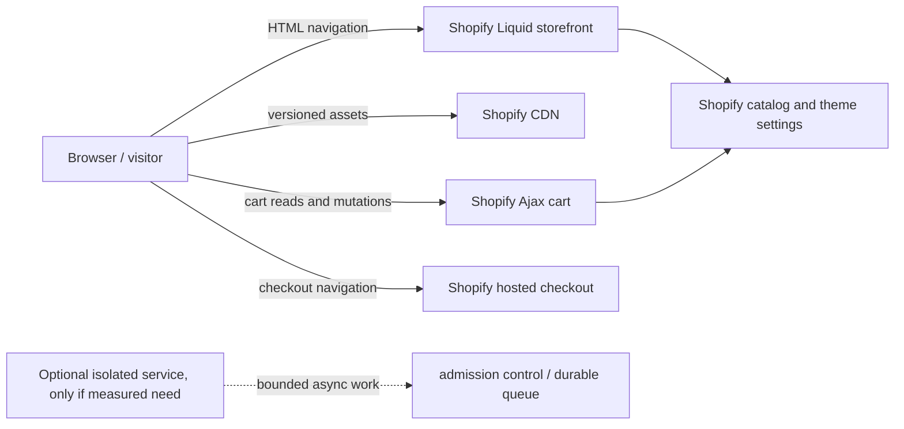

# Capacity architecture and validation

Status: capacity design and local mock are prepared; Shopify production capacity has not been measured or confirmed. Reviewed 2026-09-24.

Kindred Grove currently uses a Shopify Liquid theme. Shopify operates the storefront rendering platform, CDN, catalog, cart and hosted checkout. The theme controls rendered markup, browser-side requests, asset use and the client experience; it cannot resize or tune Shopify's internal serving tiers. Shopify documents distinct limits by API, and says it can temporarily reduce limits to protect platform stability. Storefront API buyer-traffic guidance is not a capacity statement for Liquid page rendering, native Ajax endpoints, a particular merchant plan, or checkout as a whole. Obtain written platform guidance for the exact store, event and proposed workload before promising a peak. [Shopify API limits](https://shopify.dev/docs/api/usage/limits), [Storefront API limits](https://shopify.dev/docs/api/storefront/latest).



Shopify's theme guidance describes its CDN, versioned asset URLs, compression and browser delivery behavior. Theme code should use Shopify's URL filters and avoid extra third-party origins where possible. Liquid execution still contributes to HTML time-to-first-byte; a CDN for static assets does not prove that dynamic HTML or cart operations are cache hits. Cache behavior for shopper-specific or commerce responses must follow Shopify's platform behavior and must never be changed to share cart, customer, consent or checkout state between visitors. [Shopify platform performance](https://shopify.dev/docs/storefronts/themes/best-practices/performance/platform), [theme performance guidance](https://shopify.dev/docs/storefronts/themes/best-practices/performance/index).

## Model demand before choosing architecture

Simultaneous visitors (`C`) are not requests per second. The current maintained scenario in [`scripts/capacity/scenarios.json`](../scripts/capacity/scenarios.json) uses a 10-second average between page views, 8 static asset requests per view, an assumed 95% static cache hit fraction, 0.05 cart writes per view, 0.01 checkout starts per view, and a 3× burst multiplier. These are model inputs, not measured Kindred Grove behavior or Shopify cache statistics. Recalculate them from an event's expected audience, navigation depth, device/network mix, campaign links, add-to-cart behavior, and Shopify's own capacity guidance.

Let `P = C / V`, where `V` is average seconds per page view. Then:

- Page navigations per second = `P`.
- Static edge requests per second = `P × static_requests_per_view`.
- Illustrative static cache misses = `P × static_requests_per_view × (1 − assumed_hit_fraction)`. This is a sensitivity estimate only; Shopify's internal origin requests are not observable or configurable from this theme.
- Cart mutations per second = `P × cart_mutations_per_view`.
- Checkout starts per second = `P × checkout_starts_per_view`.
- For a modeled burst, multiply each rate by the burst factor. Do not use that arithmetic as a platform quota.
- By Little's Law, average in-flight work is approximately arrival rate × average service time (`L = λW`). It is different from both active visitors and throughput; use latency distributions and observed arrival patterns, not a single average, for engineering decisions.

| Simultaneous active visitors | Page navigations/s | Static edge requests/s | Assumed static misses/s | Cart writes/s | Checkout starts/s | 3× burst: pages / cart writes / checkout starts per second |
|---:|---:|---:|---:|---:|---:|---:|
| 10,000 | 1,000 | 8,000 | 400 | 50 | 10 | 3,000 / 150 / 30 |
| 100,000 | 10,000 | 80,000 | 4,000 | 500 | 100 | 30,000 / 1,500 / 300 |
| 1,000,000 | 100,000 | 800,000 | 40,000 | 5,000 | 1,000 | 300,000 / 15,000 / 3,000 |

This single-variable model hides important effects. A short campaign link burst, crawlers, cache-cold deployments, slow clients, long-running media transfers, repeated search, cart polling, payment selection and checkout conversion can change the mix materially. Model each separately. Do not infer that every page view produces an origin hit, or that a successful homepage means the cart and checkout are available.

## Bottleneck map and ownership

| Path | Main capacity questions | Owner / evidence required |
|---|---|---|
| Static images, fonts, CSS, JS, video | Bytes per view, cache behavior, cold/warm requests, transfer duration, regional latency, origin fallback | Theme controls bytes and loading policy; Shopify operates its CDN. Measure browser waterfalls and field/lab performance. Shopify's public CDN guidance does not establish event-specific edge capacity. |
| Liquid HTML | TTFB by route, catalog/section complexity, nested loops, app blocks, market and personalization effects | Shopify operates rendering. Reduce expensive Liquid and app work; use Shopify performance tools and ask Shopify for high-event guidance. Do not claim the theme can scale Liquid workers. |
| Browser/API reads | Requests per session, cancellation, stale results, 429/430/5xx behavior, retry pressure | Theme controls request count and bounded recovery. Storefront API, Admin API and native Ajax each have different contracts and limits; don't transfer one API's limit to another. |
| Cart | Native add/change/update/read success, duplicate-write risk, isolation of visitor state, latency | Shopify operates the native cart. Theme serializes user intent, avoids automatic retry after uncertain writes and reconciles by reading cart state. Use isolated test carts; do not run public synthetic mutations without approval. |
| Checkout | Checkout starts/minute, checkout creation throttling, payments/shipping/tax dependencies, regional event configuration | Shopify and configured providers own this path. Shopify documents a separate Storefront API checkout-creation throttle; it is not a general checkout capacity promise. Confirm the exact commerce and payment setup with Shopify before a peak. Never test by placing orders. |
| Optional external service | Queue age, concurrency, database connections, idempotency, outbound quotas, privacy retention, regional availability | Introduce only after measured platform/theme limits or a product requirement demonstrate need. An async service must not become an unreviewed checkout dependency. |

Shopify's Storefront API documentation says buyer traffic is treated differently from automated traffic, describes a checkout-level throttle and requires correct buyer IP information for server-side buyer requests. Those statements apply to that API and its documented semantics only. Do not bypass bot controls or fake buyer identity to produce load. [Storefront API rate limits](https://shopify.dev/docs/api/storefront/latest).

## Graduation gates by audience target

These are planning stages, not claims that this store supports any audience size. Each stage is blocked until the prior evidence exists and the merchant authorizes the specific test environment, traffic source, time window and spend boundary. No mandatory headless rebuild or custom infrastructure is implied.

| Target | Evidence before progressing | Likely bottlenecks to investigate | Go / no-go |
|---|---|---|---|
| 10,000 simultaneous visitors | Measure real route/view/session mix; test cold and warm assets on representative devices/regions; establish baseline p50/p95/p99 for page, product, cart and checkout navigation; confirm store/market/payment configuration with Shopify; test graceful behavior on throttling and network failures. | Liquid TTFB, large media, expensive app embeds, catalog availability, bursty cart writes and checkout readiness. | No event promise until Shopify's store-specific guidance, a realistic approved test and rollback/incident ownership are documented. |
| 100,000 simultaneous visitors | Re-run at the measured 10k mix with explicit burst and soak profiles, multiple regions and cache-cold conditions; test dependence failures; review concurrency and queue/back-pressure behavior for every custom dependency. | Campaign burst, third-party/app calls, cache miss amplification, API throttling, cart write coordination and checkout creation caps. | Escalate capacity questions to Shopify and affected providers. Change architecture only for a measured bottleneck; prove fail-open/fail-closed behavior and recovery before adding any service. |
| 1,000,000 or more simultaneous visitors | Written store-specific platform capacity/traffic plan; test topology approved by Shopify and providers; controlled ramp, global-region and device mix, realistic campaign/crawler separation, soak, abort and recovery exercises; staffed incident coverage and agreed customer communications. | Platform-level storefront rendering, cart/checkout and payment limits, global distribution, cache-cold demand, provider quotas, event operations and media bandwidth. | No go based on a theme mock, API documentation alone, local harness or another merchant's result. Shopify and payment/shipping providers must confirm the exact relevant capacity and restrictions. |

For any approved load exercise, record revision and role, environment, region, test window, concurrency and arrival-rate profile, think time, endpoint mix, cache state, request counts, p50/p95/p99, error classes, cancellation, resource saturation where observable, ramp/abort limits and responsible operator. Start below target, raise load in reviewed steps, stop at platform rejection or error-budget threshold, and never retry rejected traffic aggressively. A load test can itself affect live commerce; use a platform-approved environment and traffic plan, not the public store by default.

## When a custom service might be justified

Keep a native Shopify theme while it meets product needs and verified operational targets. A custom service is justified only when a measured limitation or required capability cannot be handled safely by Shopify's native storefront, app or admin tools. Headless Hydrogen is one possible product/architecture choice, not a necessary scale milestone; it shifts more responsibility to the team for rendering, cache keys, sessions, deployment, API usage and observability. It cannot remove Shopify cart, checkout, payment or provider constraints.

If an independent asynchronous service is warranted, keep it outside the critical checkout path where possible. Define authenticated callers, data minimization, idempotent side effects, per-client and global admission control, bounded queue length/age, retry and dead-letter rules, degraded behavior, retention, backups, recovery and a named operator before implementation. A full queue must reject work honestly rather than claim it was saved. Use one maintainable configuration boundary for limits, timeouts, URLs and provider selection. Any hosting, database, monitoring or provider bill is a separate future cost decision; no such spend or service is authorized by this plan.

## Evidence and local harness

The local deterministic model and loopback-only mock are useful for checking equations, input validation, bounded concurrency and synthetic failures. A fresh run on 2026-09-24 completed 1,000/1,000 synthetic requests at configured concurrency 10, peak in-flight 10, duration 1,332.823 ms, throughput 750.287 requests/s, p50 15.117 ms, p95 20.076 ms and p99 31.192 ms on one Windows development machine (Node v24.20.0, win32 x64, 12 logical CPUs). The run had zero errors, zero configured synthetic delay, and closed its loopback server. Its output is `LOCAL_MOCK_NOT_SHOPIFY`; it sends no traffic to Shopify and proves no external capacity. The scale values in this document are `PROJECTED`, not measured.

```sh
node scripts/capacity/model.cjs
node scripts/capacity/local-harness.cjs
node --test tests/security/capacity-model.test.cjs
```

The harness binds only to `127.0.0.1`, accepts no destination URL, and enforces configured request, concurrency and duration bounds. Do not modify it into an external load generator without a separate authorization and safety design.

Media is a first-order user and network cost. The journey asset is 5,762,469 bytes on disk (about 5.50 MiB); one million complete downloads would total about 5.24 TiB before protocol overhead. That's transfer arithmetic, not observed CDN egress, billing or cache-miss volume. Measure start/finish rates, device/network classes, actual byte ranges, cache behavior and abandoned downloads before a campaign. Keep posters, still imagery and reduced-motion behavior usable; compare native hosted range playback with the existing whole-asset behavior using real browser measurements before changing it.

## References

- [Shopify API limits](https://shopify.dev/docs/api/usage/limits) — API-specific rate limiting and guidance to cache, regulate and recover responsibly.
- [Shopify Storefront API rate limits](https://shopify.dev/docs/api/storefront/latest) — buyer versus automated traffic and checkout-level throttle.
- [Shopify theme performance](https://shopify.dev/docs/storefronts/themes/best-practices/performance/index) and [Shopify platform/CDN](https://shopify.dev/docs/storefronts/themes/best-practices/performance/platform) — Liquid timing, asset delivery and theme practices.
- [Shopify theme CLI](https://shopify.dev/docs/storefronts/themes/tools/cli) — development themes and supported theme workflows.
- [Google SRE Workbook: implementing SLOs](https://sre.google/workbook/implementing-slos/) — event-based indicators, objective ownership and error budgets.
